# PeerSync Implementation Guidelines

This document is the **definitive coding reference** for the PeerSync Intercom & Media Share application. Every file, interface, constant, protocol message, state transition, and user flow is specified here. No implementation decision should require guesswork.

**Companion Documents:**
- [SoftwareRequirements.md](./SoftwareRequirements.md) — the "what" and "why"
- [ImplementationPlan.md](./ImplementationPlan.md) — the phased "when" and design decisions

---

## 1. System Constants

All magic numbers are defined here. No hardcoded literals in source code — reference these constants.

### 1.1 Network Constants

| Constant | Value | Notes |
| :--- | :--- | :--- |
| `TCP_PORT` | `8730` | Control Plane TCP server port on GO |
| `UDP_PORT` | `8731` | Data Plane UDP port (send & receive) |
| `GO_IP` | `192.168.49.1` | Standard Wi-Fi Direct GO IP address |
| `NSD_SERVICE_TYPE` | `"_peersync._tcp"` | Bonjour/NSD service type string |
| `NSD_SERVICE_NAME` | `"PeerSync"` | NSD service name broadcast by GO |
| `GO_HEARTBEAT_INTERVAL_MS` | `2000` | GO sends heartbeat every 2 seconds |
| `GO_HEARTBEAT_TIMEOUT_MS` | `5000` | Client declares GO loss after 5 seconds of silence |
| `NTP_SYNC_INTERVAL_MS` | `5000` | GO broadcasts clock sync every 5 seconds |
| `MAX_PEERS` | `5` | Maximum peers including GO (GO + 4 clients) |

### 1.2 Security Constants

| Constant | Value | Notes |
| :--- | :--- | :--- |
| `PIN_LENGTH` | `6` | 6-digit numeric PIN |
| `MAX_PIN_ATTEMPTS` | `3` | Lock out after 3 failures |
| `PIN_COOLDOWN_MS` | `30000` | 30-second cooldown after lockout |
| `NSD_TOKEN_ALGO` | `"HmacSHA256"` | Algorithm for NSD session token (SRS §3.1) |
| `NSD_NONCE_BYTES` | `16` | Random nonce length for session token generation |

### 1.3 Audio Constants

| Constant | Value | Notes |
| :--- | :--- | :--- |
| `VOICE_SAMPLE_RATE` | `16000` | 16 kHz for voice |
| `VOICE_CHANNELS` | `1` | Mono |
| `VOICE_BITRATE` | `24000` | 24 kbps Opus VOIP |
| `MUSIC_SAMPLE_RATE` | `44100` | 44.1 kHz for music |
| `MUSIC_CHANNELS` | `2` | Stereo |
| `MUSIC_BITRATE` | `96000` | 96 kbps Opus Audio |
| `OPUS_FRAME_MS` | `20` | 20ms frame size |
| `VOICE_FRAME_SAMPLES` | `320` | 16000 × 0.020 = 320 samples/frame |
| `MUSIC_FRAME_SAMPLES` | `882` | 44100 × 0.020 = 882 samples/frame |
| `RING_BUFFER_CAPACITY` | `512` | Frames in each ring buffer |

### 1.4 Jitter Buffer & Mixing Constants

| Constant | Value | Notes |
| :--- | :--- | :--- |
| `JITTER_BUFFER_DEPTH` | `3` | 3 packets = 60ms at 20ms frames |
| `KEEPALIVE_INTERVAL_MS` | `500` | Heartbeat packet during VAD silence |
| `DUCK_ATTACK_MS` | `50` | Fade-down time when voice detected |
| `DUCK_RELEASE_MS` | `250` | Fade-up time when voice stops |
| `DUCK_ATTENUATION` | `0.4f` | Multiply music amplitude by 0.4 (60% reduction) |
| `DUCK_HOLD_MS` | `300` | Hold ducked state for 300ms after last voice packet |
| `VAD_AGGRESSIVENESS_DEFAULT` | `2` | WebRTC VAD aggressiveness (0–3) |
| `MAX_MUSIC_DRIFT_MS` | `50` | Maximum tolerated music sync drift |

---

## 2. Complete File & Module Structure

Every file that must be created, with its purpose.

```
PeerSync/
├── docs/
│   ├── SoftwareRequirements.md
│   ├── ImplementationPlan.md
│   └── ImplementationGuidelines.md          ← this document
│
├── settings.gradle.kts                      # Project name, module includes
├── build.gradle.kts                         # Root: plugin version catalog
├── gradle.properties                        # KMP flags, Android flags
├── gradle/
│   └── libs.versions.toml                   # Version catalog (Kotlin, CMP, AGP, etc.)
│
└── composeApp/
    ├── build.gradle.kts                     # Module: plugins, dependencies, CMake
    └── src/
        ├── commonMain/kotlin/com/peersync/app/
        │   ├── App.kt                       # Root @Composable, Material 3 theme
        │   ├── navigation/
        │   │   └── NavGraph.kt              # 2-screen nav: SessionList ↔ ActiveSession
        │   ├── ui/
        │   │   ├── sessionlist/
        │   │   │   ├── SessionListScreen.kt # Discover, create, join UI
        │   │   │   └── SessionListViewModel.kt
        │   │   └── activesession/
        │   │       ├── ActiveSessionScreen.kt # Peers, audio levels, media controls
        │   │       └── ActiveSessionViewModel.kt
        │   └── model/
        │       ├── SessionInfo.kt           # Discovered session data
        │       ├── PeerDevice.kt            # Connected peer data
        │       ├── ConnectionState.kt       # Sealed interface for conn states
        │       ├── ControlMessage.kt        # Sealed class for TCP messages
        │       ├── MediaAction.kt           # Enum: PLAY, PAUSE, SKIP
        │       └── AudioPacketHeader.kt     # 4-byte UDP header model
        │
        ├── androidMain/
        │   ├── AndroidManifest.xml
        │   ├── kotlin/com/peersync/app/
        │   │   ├── MainActivity.kt          # Permissions, setContent, service binding
        │   │   ├── PeerSyncApplication.kt   # Application class (optional DI root)
        │   │   ├── service/
        │   │   │   └── PeerSyncService.kt   # Foreground service: lifecycle, wake lock
        │   │   ├── engine/
        │   │   │   └── PeerSyncEngine.kt    # Orchestrator: wires network + audio
        │   │   ├── network/
        │   │   │   ├── WifiP2pController.kt # Wi-Fi Direct: discover, connect, GO setup
        │   │   │   ├── TcpControlPlane.kt   # TCP server (GO) / client (Spoke)
        │   │   │   └── UdpDataPlane.kt      # UDP send/receive, GO packet forwarding
        │   │   ├── audio/
        │   │   │   ├── AudioBridge.kt       # JNI bridge: Kotlin ↔ native C++
        │   │   │   └── MediaHostManager.kt  # SAF picker, decode, Opus encode, stream
        │   │   └── security/
        │   │       └── PinManager.kt        # PIN generation, validation, rate limiting
        │   │
        │   └── cpp/
        │       ├── CMakeLists.txt           # Build config: Oboe, libopus, libwebrtc_vad
        │       ├── jni_bridge.cpp           # JNI exported functions
        │       ├── audio_engine.h / .cpp    # Oboe streams: capture + playback
        │       ├── opus_codec.h / .cpp      # Opus encoder/decoder (voice + music)
        │       ├── ring_buffer.h / .cpp     # Lock-free SPSC ring buffer
        │       ├── webrtc_vad.h / .cpp      # WebRTC VAD wrapper
        │       ├── jitter_buffer.h / .cpp   # Fixed-depth reorder buffer
        │       └── mixer.h / .cpp           # N-stream PCM mixer + ducking
        │
        └── androidMain/res/
            ├── values/strings.xml           # App strings
            └── drawable/                    # App icons
```

---

## 3. Data Models & Protocol Specification

### 3.1 UDP Data Plane — Packet Format

Every UDP packet has a **4-byte header** followed by an Opus-encoded **payload**.

```
┌──────────────────────────────────────────────────────┐
│  Byte 0   │  Byte 1   │  Byte 2   │  Byte 3  │ ... │
│ Origin ID │ Payload   │    Sequence Index     │Opus │
│ (uint8)   │ Flag      │   (uint16, big-end)   │Data │
│           │ (uint8)   │                       │     │
└──────────────────────────────────────────────────────┘
```

| Field | Size | Values |
| :--- | :--- | :--- |
| **User Origin ID** | 1 byte (uint8) | `0x00` = GO, `0x01`–`0xFE` = clients. `0xFF` reserved. |
| **Payload Flag** | 1 byte (uint8) | `0x00` = Keep-Alive, `0x01` = Voice, `0x02` = Music |
| **Sequence Index** | 2 bytes (uint16 BE) | Wraps at 65535 → 0. Per-stream counter (keyed by Origin ID + Flag). |
| **Payload** | Variable | Opus-encoded audio bytes. Empty for Keep-Alive (`0x00`). |

**Keep-Alive packets** (flag `0x00`): Header only, no payload. 8 bytes total (4 header + 4 zero-padding for alignment). Sent every `KEEPALIVE_INTERVAL_MS` during VAD silence.

**Voice packets** (flag `0x01`): ~60–80 bytes payload (Opus VOIP, 24 kbps, 20ms frame).

**Music packets** (flag `0x02`): ~240–320 bytes payload (Opus Audio, 96 kbps, 20ms frame).

### 3.2 TCP Control Plane — Message Format

Every TCP message uses a **length-prefixed binary envelope** with a **JSON payload**.

```
┌─────────────────────────────────────────────┐
│  Bytes 0–1  │  Byte 2     │  Bytes 3–N     │
│ Total Len   │ Message     │ JSON Payload   │
│ (uint16 BE) │ Type (uint8)│ (UTF-8 string) │
└─────────────────────────────────────────────┘
```

**Total Length** includes the type byte + JSON payload (i.e., `len = 1 + json_bytes.length`).

### 3.3 TCP Message Types

| Type Code | Name | Direction | JSON Payload |
| :--- | :--- | :--- | :--- |
| `0x01` | `JOIN_REQUEST` | Client → GO | `{ "pin": "123456", "deviceName": "Pixel 8" }` |
| `0x02` | `JOIN_RESPONSE` | GO → Client | `{ "accepted": true, "assignedId": 2, "members": [...], "mediaHostId": null, "sessionPin": "123456" }` |
| `0x03` | `MEMBER_JOINED` | GO → All Clients | `{ "id": 2, "deviceName": "Pixel 8" }` |
| `0x04` | `MEMBER_LEFT` | GO → All Clients | `{ "id": 2 }` |
| `0x05` | `HEARTBEAT` | GO → All Clients | `{ "timestamp": 1690123456789 }` |
| `0x06` | `MEDIA_HOST_REQUEST` | Client → GO | `{ "requesterId": 2 }` |
| `0x07` | `MEDIA_HOST_GRANT` | GO → All Clients | `{ "hostId": 2 }` (or `{ "hostId": null }` for release) |
| `0x08` | `MEDIA_HOST_RELEASE` | Client → GO | `{ "hostId": 2 }` |
| `0x09` | `MEDIA_CONTROL` | Any → GO → All | `{ "action": "PLAY" \| "PAUSE" \| "SKIP", "senderId": 3 }` |
| `0x0A` | `NTP_SYNC_REQUEST` | GO → Client | `{ "t1": 1690123456789 }` |
| `0x0B` | `NTP_SYNC_RESPONSE` | Client → GO | `{ "t1": ..., "t2": ..., "t3": ... }` |
| `0x0C` | `MUSIC_POSITION_SYNC` | GO → All | `{ "positionMs": 45230, "goTimestamp": 1690123456789 }` |

**`JOIN_RESPONSE.members` array format:**
```json
[
  { "id": 0, "deviceName": "Galaxy S24 (GO)" },
  { "id": 1, "deviceName": "Pixel 8" }
]
```

### 3.4 Kotlin Data Models

```kotlin
// model/SessionInfo.kt
data class SessionInfo(
    val serviceName: String,
    val deviceAddress: String, // Wi-Fi Direct MAC
    val deviceName: String,
    val sessionToken: String   // HMAC-SHA256 token from NSD TXT record (SRS §3.1)
)

// model/PeerDevice.kt
data class PeerDevice(
    val id: Int,                  // User Origin ID (0 = GO)
    val deviceName: String,
    val isGroupOwner: Boolean,
    val isMediaHost: Boolean,
    val audioLevel: Float         // 0.0–1.0, updated from native layer
)

// model/ConnectionState.kt
sealed interface ConnectionState {
    data object Disconnected : ConnectionState
    data object Discovering : ConnectionState
    data object Connecting : ConnectionState
    data class PinChallenge(val sessionInfo: SessionInfo) : ConnectionState
    data class Connected(val isGroupOwner: Boolean, val selfId: Int) : ConnectionState
    data class Reconnecting(val reason: String) : ConnectionState
    data class Error(val message: String) : ConnectionState
}

// model/MediaAction.kt
enum class MediaAction { PLAY, PAUSE, SKIP }

// model/ControlMessage.kt — sealed hierarchy for type-safe TCP message handling
sealed class ControlMessage(val typeCode: Byte) {
    data class JoinRequest(val pin: String, val deviceName: String) : ControlMessage(0x01)
    data class JoinResponse(
        val accepted: Boolean,
        val assignedId: Int,
        val members: List<PeerDevice>,
        val mediaHostId: Int?,
        val sessionPin: String
    ) : ControlMessage(0x02)
    data class MemberJoined(val id: Int, val deviceName: String) : ControlMessage(0x03)
    data class MemberLeft(val id: Int) : ControlMessage(0x04)
    data class Heartbeat(val timestamp: Long) : ControlMessage(0x05)
    data class MediaHostRequest(val requesterId: Int) : ControlMessage(0x06)
    data class MediaHostGrant(val hostId: Int?) : ControlMessage(0x07)
    data class MediaHostRelease(val hostId: Int) : ControlMessage(0x08)
    data class MediaControl(val action: MediaAction, val senderId: Int) : ControlMessage(0x09)
    data class NtpSyncRequest(val t1: Long) : ControlMessage(0x0A)
    data class NtpSyncResponse(val t1: Long, val t2: Long, val t3: Long) : ControlMessage(0x0B)
    data class MusicPositionSync(val positionMs: Long, val goTimestamp: Long) : ControlMessage(0x0C)
}

// model/AudioPacketHeader.kt
data class AudioPacketHeader(
    val originId: Int,       // 0–254
    val payloadFlag: Int,    // 0x00, 0x01, 0x02
    val sequenceIndex: Int   // 0–65535
) {
    companion object {
        const val HEADER_SIZE = 4
        const val FLAG_KEEPALIVE = 0x00
        const val FLAG_VOICE = 0x01
        const val FLAG_MUSIC = 0x02
    }
}
```

---

## 4. User Flows

### 4.1 App Launch & Permission Flow

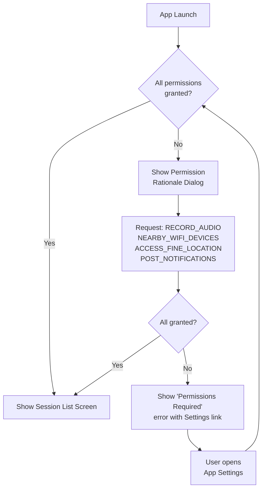
```mermaid
flowchart TD
    A["App Launch"] --> B{"All permissions\ngranted?"}
    B -- Yes --> D["Show Session List Screen"]
    B -- No --> C["Show Permission\nRationale Dialog"]
    C --> C1["Request: RECORD_AUDIO\nNEARBY_WIFI_DEVICES\nACCESS_FINE_LOCATION\nPOST_NOTIFICATIONS"]
    C1 --> C2{"All granted?"}
    C2 -- Yes --> D
    C2 -- No --> C3["Show 'Permissions Required'\nerror with Settings link"]
    C3 --> C4["User opens\nApp Settings"]
    C4 --> B
```

### 4.2 Create Session Flow (Become GO)

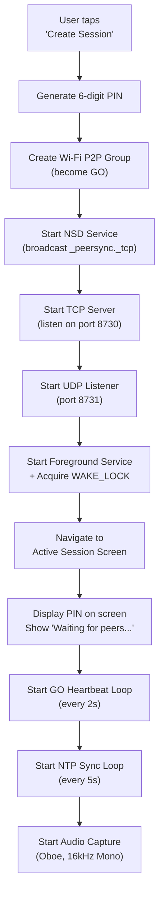
```mermaid
flowchart TD
    A["User taps\n'Create Session'"] --> B["Generate 6-digit PIN"]
    B --> C["Create Wi-Fi P2P Group\n(become GO)"]
    C --> D["Start NSD Service\n(broadcast _peersync._tcp)"]
    D --> E["Start TCP Server\n(listen on port 8730)"]
    E --> F["Start UDP Listener\n(port 8731)"]
    F --> G["Start Foreground Service\n+ Acquire WAKE_LOCK"]
    G --> H["Navigate to\nActive Session Screen"]
    H --> I["Display PIN on screen\nShow 'Waiting for peers...'"]
    I --> J["Start GO Heartbeat Loop\n(every 2s)"]
    J --> K["Start NTP Sync Loop\n(every 5s)"]
    K --> L["Start Audio Capture\n(Oboe, 16kHz Mono)"]
```

### 4.3 Join Session Flow (Become Client)

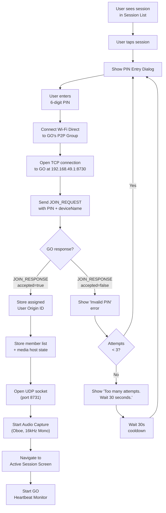
```mermaid
flowchart TD
    A["User sees session\nin Session List"] --> B["User taps session"]
    B --> C["Show PIN Entry Dialog"]
    C --> D["User enters\n6-digit PIN"]
    D --> E["Connect Wi-Fi Direct\nto GO's P2P Group"]
    E --> F["Open TCP connection\nto GO at 192.168.49.1:8730"]
    F --> G["Send JOIN_REQUEST\nwith PIN + deviceName"]
    G --> H{"GO response?"}
    H -- "JOIN_RESPONSE\naccepted=true" --> I["Store assigned\nUser Origin ID"]
    I --> J["Store member list\n+ media host state"]
    J --> K["Open UDP socket\n(port 8731)"]
    K --> L["Start Audio Capture\n(Oboe, 16kHz Mono)"]
    L --> M["Navigate to\nActive Session Screen"]
    M --> N["Start GO\nHeartbeat Monitor"]
    H -- "JOIN_RESPONSE\naccepted=false" --> O["Show 'Invalid PIN'\nerror"]
    O --> P{"Attempts\n< 3?"}
    P -- Yes --> C
    P -- No --> Q["Show 'Too many attempts.\nWait 30 seconds.'"]
    Q --> R["Wait 30s\ncooldown"]
    R --> C
```

### 4.4 Active Voice Communication Flow

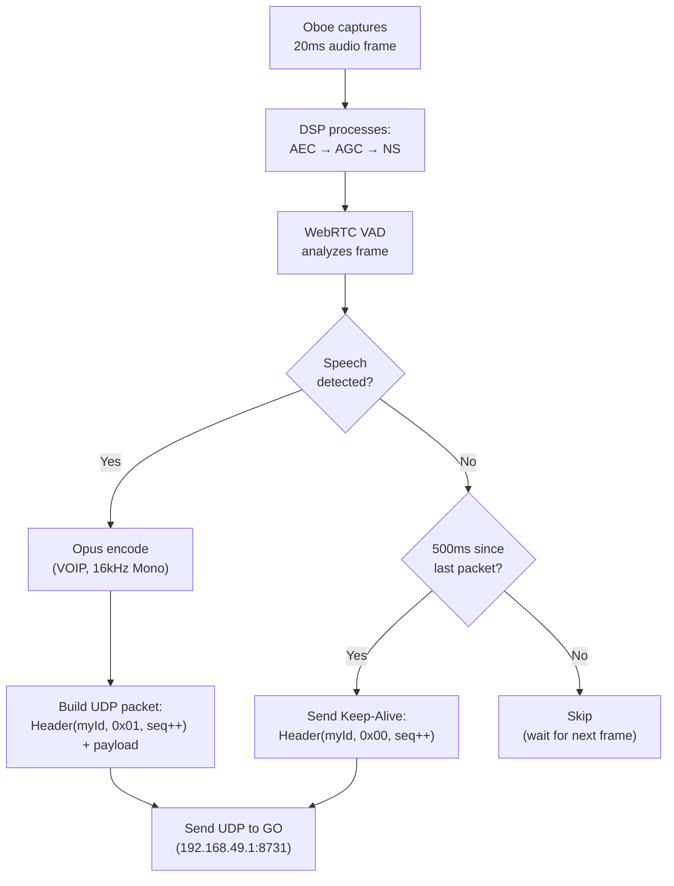
```mermaid
flowchart TD
    A["Oboe captures\n20ms audio frame"] --> B["DSP processes:\nAEC → AGC → NS"]
    B --> C["WebRTC VAD\nanalyzes frame"]
    C --> D{"Speech\ndetected?"}
    D -- Yes --> E["Opus encode\n(VOIP, 16kHz Mono)"]
    E --> F["Build UDP packet:\nHeader(myId, 0x01, seq++) + payload"]
    F --> G["Send UDP to GO\n(192.168.49.1:8731)"]
    D -- No --> H{"500ms since\nlast packet?"}
    H -- Yes --> I["Send Keep-Alive:\nHeader(myId, 0x00, seq++)"]
    I --> G
    H -- No --> J["Skip\n(wait for next frame)"]
```

### 4.5 Music Sharing Flow (Media Host)

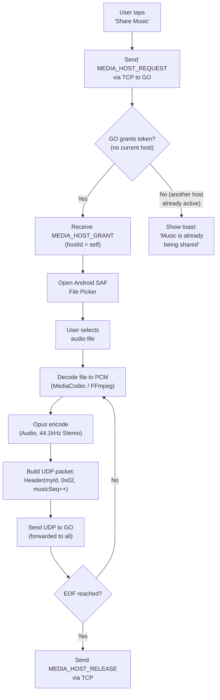
```mermaid
flowchart TD
    A["User taps\n'Share Music'"] --> B["Send MEDIA_HOST_REQUEST\nvia TCP to GO"]
    B --> C{"GO grants token?\n(no current host)"}
    C -- Yes --> D["Receive MEDIA_HOST_GRANT\n(hostId = self)"]
    D --> E["Open Android SAF\nFile Picker"]
    E --> F["User selects\naudio file"]
    F --> G["Decode file to PCM\n(MediaCodec / FFmpeg)"]
    G --> H["Opus encode\n(Audio, 44.1kHz Stereo)"]
    H --> I["Build UDP packet:\nHeader(myId, 0x02, musicSeq++)"]
    I --> J["Send UDP to GO\n(forwarded to all)"]
    J --> K{"EOF reached?"}
    K -- No --> G
    K -- Yes --> L["Send MEDIA_HOST_RELEASE\nvia TCP"]
    C -- "No (another host\nalready active)" --> M["Show toast:\n'Music is already\nbeing shared'"]
```

### 4.6 Disconnect Flow

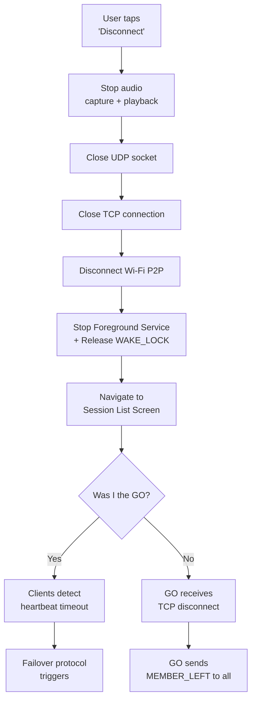
```mermaid
flowchart TD
    A["User taps\n'Disconnect'"] --> B["Stop audio\ncapture + playback"]
    B --> C["Close UDP socket"]
    C --> D["Close TCP connection"]
    D --> E["Disconnect Wi-Fi P2P"]
    E --> F["Stop Foreground Service\n+ Release WAKE_LOCK"]
    F --> G["Navigate to\nSession List Screen"]
    G --> H{"Was I the GO?"}
    H -- Yes --> I["Clients detect\nheartbeat timeout"]
    I --> J["Failover protocol\ntriggers"]
    H -- No --> K["GO receives\nTCP disconnect"]
    K --> L["GO sends\nMEMBER_LEFT to all"]
```

---

## 5. Sequence Diagrams

### 5.1 Session Creation & Peer Join

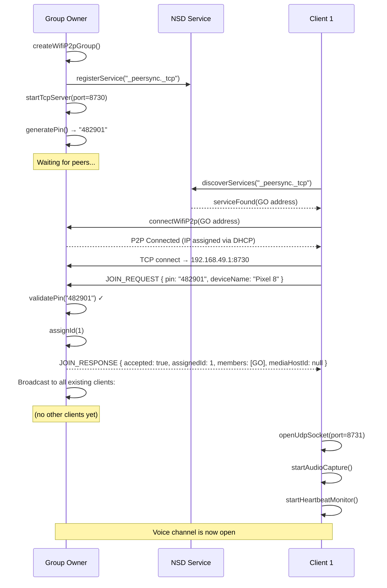
```mermaid
sequenceDiagram
    participant GO as Group Owner
    participant NSD as NSD Service
    participant C1 as Client 1

    GO->>GO: createWifiP2pGroup()
    GO->>NSD: registerService("_peersync._tcp")
    GO->>GO: startTcpServer(port=8730)
    GO->>GO: generatePin() → "482901"

    Note over GO: Waiting for peers...

    C1->>NSD: discoverServices("_peersync._tcp")
    NSD-->>C1: serviceFound(GO address)
    C1->>GO: connectWifiP2p(GO address)
    GO-->>C1: P2P Connected (IP assigned via DHCP)

    C1->>GO: TCP connect → 192.168.49.1:8730
    C1->>GO: JOIN_REQUEST { pin: "482901", deviceName: "Pixel 8" }

    GO->>GO: validatePin("482901") ✓
    GO->>GO: assignId(1)
    GO-->>C1: JOIN_RESPONSE { accepted: true, assignedId: 1, members: [GO], mediaHostId: null }

    GO->>GO: Broadcast to all existing clients:
    Note over GO: (no other clients yet)

    C1->>C1: openUdpSocket(port=8731)
    C1->>C1: startAudioCapture()
    C1->>C1: startHeartbeatMonitor()

    Note over GO,C1: Voice channel is now open
```

### 5.2 Full-Duplex Voice — End to End

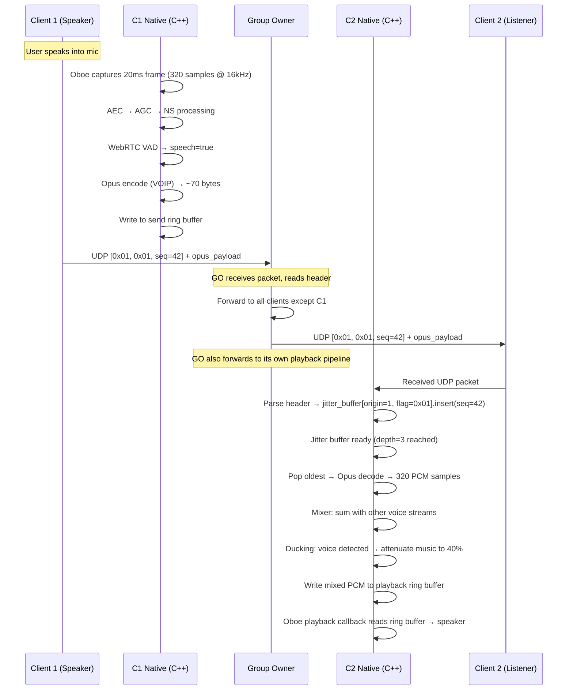
```mermaid
sequenceDiagram
    participant C1 as Client 1 (Speaker)
    participant C1N as C1 Native (C++)
    participant GO as Group Owner
    participant C2N as C2 Native (C++)
    participant C2 as Client 2 (Listener)

    Note over C1: User speaks into mic

    C1N->>C1N: Oboe captures 20ms frame (320 samples @ 16kHz)
    C1N->>C1N: AEC → AGC → NS processing
    C1N->>C1N: WebRTC VAD → speech=true
    C1N->>C1N: Opus encode (VOIP) → ~70 bytes
    C1N->>C1N: Write to send ring buffer

    C1->>GO: UDP [0x01, 0x01, seq=42] + opus_payload
    Note over GO: GO receives packet, reads header

    GO->>GO: Forward to all clients except C1
    GO->>C2: UDP [0x01, 0x01, seq=42] + opus_payload
    Note over GO: GO also forwards to its own playback pipeline

    C2->>C2N: Received UDP packet
    C2N->>C2N: Parse header → jitter_buffer[origin=1, flag=0x01].insert(seq=42)
    C2N->>C2N: Jitter buffer ready (depth=3 reached)
    C2N->>C2N: Pop oldest → Opus decode → 320 PCM samples
    C2N->>C2N: Mixer: sum with other voice streams
    C2N->>C2N: Ducking: voice detected → attenuate music to 40%
    C2N->>C2N: Write mixed PCM to playback ring buffer
    C2N->>C2N: Oboe playback callback reads ring buffer → speaker
```

### 5.3 GO Failover & Re-election

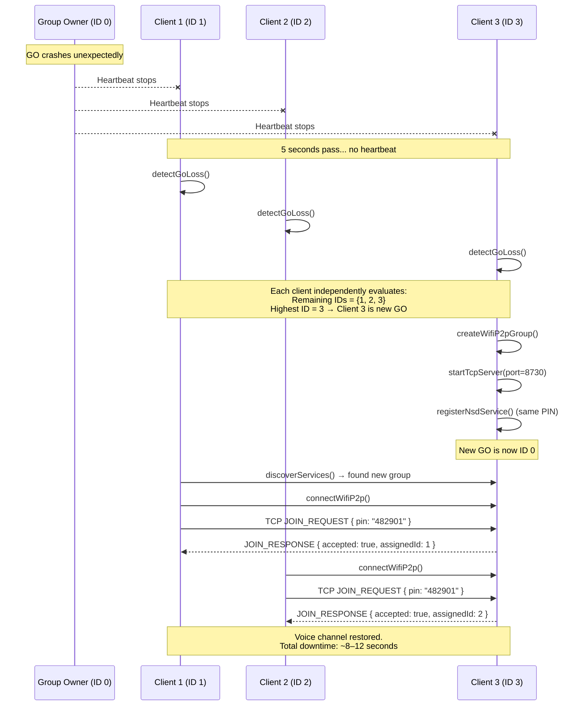
```mermaid
sequenceDiagram
    participant GO as Group Owner (ID 0)
    participant C1 as Client 1 (ID 1)
    participant C2 as Client 2 (ID 2)
    participant C3 as Client 3 (ID 3)

    Note over GO: GO crashes unexpectedly

    GO--xC1: Heartbeat stops
    GO--xC2: Heartbeat stops
    GO--xC3: Heartbeat stops

    Note over C1,C3: 5 seconds pass... no heartbeat

    C1->>C1: detectGoLoss()
    C2->>C2: detectGoLoss()
    C3->>C3: detectGoLoss()

    Note over C1,C3: Each client independently evaluates:<br/>Remaining IDs = {1, 2, 3}<br/>Highest ID = 3 → Client 3 is new GO

    C3->>C3: createWifiP2pGroup()
    C3->>C3: startTcpServer(port=8730)
    C3->>C3: registerNsdService() (same PIN)
    Note over C3: New GO is now ID 0

    C1->>C3: discoverServices() → found new group
    C1->>C3: connectWifiP2p()
    C1->>C3: TCP JOIN_REQUEST { pin: "482901" }
    C3-->>C1: JOIN_RESPONSE { accepted: true, assignedId: 1 }

    C2->>C3: connectWifiP2p()
    C2->>C3: TCP JOIN_REQUEST { pin: "482901" }
    C3-->>C2: JOIN_RESPONSE { accepted: true, assignedId: 2 }

    Note over C1,C3: Voice channel restored.<br/>Total downtime: ~8–12 seconds
```

### 5.4 Music Streaming & Ducking

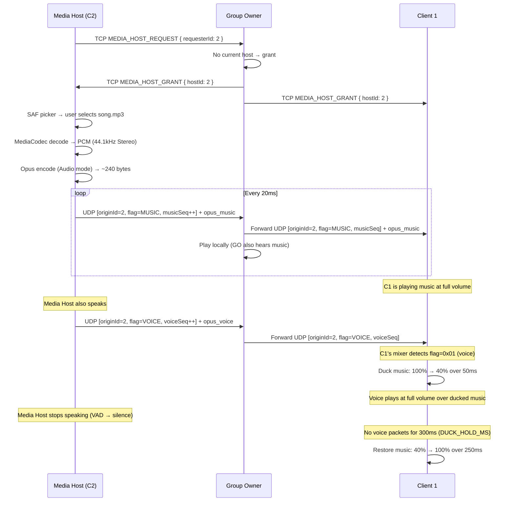
```mermaid
sequenceDiagram
    participant MH as Media Host (C2)
    participant GO as Group Owner
    participant C1 as Client 1

    MH->>GO: TCP MEDIA_HOST_REQUEST { requesterId: 2 }
    GO->>GO: No current host → grant
    GO->>MH: TCP MEDIA_HOST_GRANT { hostId: 2 }
    GO->>C1: TCP MEDIA_HOST_GRANT { hostId: 2 }

    MH->>MH: SAF picker → user selects song.mp3
    MH->>MH: MediaCodec decode → PCM (44.1kHz Stereo)
    MH->>MH: Opus encode (Audio mode) → ~240 bytes

    loop Every 20ms
        MH->>GO: UDP [originId=2, flag=MUSIC, musicSeq++] + opus_music
        GO->>C1: Forward UDP [originId=2, flag=MUSIC, musicSeq] + opus_music
        GO->>GO: Play locally (GO also hears music)
    end

    Note over C1: C1 is playing music at full volume

    Note over MH: Media Host also speaks

    MH->>GO: UDP [originId=2, flag=VOICE, voiceSeq++] + opus_voice
    GO->>C1: Forward UDP [originId=2, flag=VOICE, voiceSeq]

    Note over C1: C1's mixer detects flag=0x01 (voice)
    C1->>C1: Duck music: 100% → 40% over 50ms
    Note over C1: Voice plays at full volume over ducked music

    Note over MH: Media Host stops speaking (VAD → silence)

    Note over C1: No voice packets for 300ms (DUCK_HOLD_MS)
    C1->>C1: Restore music: 40% → 100% over 250ms
```

### 5.5 NTP Clock Synchronization

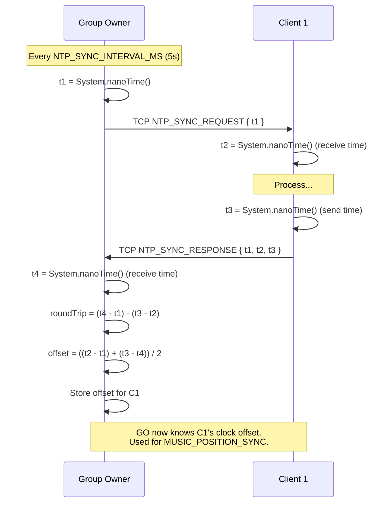
```mermaid
sequenceDiagram
    participant GO as Group Owner
    participant C1 as Client 1

    Note over GO: Every NTP_SYNC_INTERVAL_MS (5s)

    GO->>GO: t1 = System.nanoTime()
    GO->>C1: TCP NTP_SYNC_REQUEST { t1 }

    C1->>C1: t2 = System.nanoTime() (receive time)
    Note over C1: Process...
    C1->>C1: t3 = System.nanoTime() (send time)
    C1->>GO: TCP NTP_SYNC_RESPONSE { t1, t2, t3 }

    GO->>GO: t4 = System.nanoTime() (receive time)
    GO->>GO: roundTrip = (t4 - t1) - (t3 - t2)
    GO->>GO: offset = ((t2 - t1) + (t3 - t4)) / 2
    GO->>GO: Store offset for C1

    Note over GO,C1: GO now knows C1's clock offset.<br/>Used for MUSIC_POSITION_SYNC.
```

### 5.6 Media Playback Control Relay

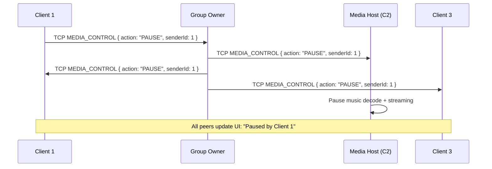
```mermaid
sequenceDiagram
    participant C1 as Client 1
    participant GO as Group Owner
    participant MH as Media Host (C2)
    participant C3 as Client 3

    C1->>GO: TCP MEDIA_CONTROL { action: "PAUSE", senderId: 1 }
    GO->>MH: TCP MEDIA_CONTROL { action: "PAUSE", senderId: 1 }
    GO->>C1: TCP MEDIA_CONTROL { action: "PAUSE", senderId: 1 }
    GO->>C3: TCP MEDIA_CONTROL { action: "PAUSE", senderId: 1 }

    MH->>MH: Pause music decode + streaming
    Note over C1,C3: All peers update UI: "Paused by Client 1"
```

---

## 6. State Machines

### 6.1 Connection State Machine

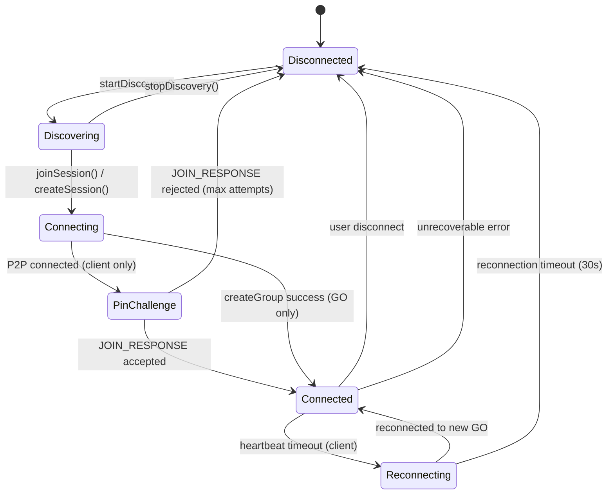
```mermaid
stateDiagram-v2
    [*] --> Disconnected

    Disconnected --> Discovering : startDiscovery()
    Discovering --> Disconnected : stopDiscovery()
    Discovering --> Connecting : joinSession() / createSession()
    Connecting --> PinChallenge : P2P connected (client only)
    PinChallenge --> Connected : JOIN_RESPONSE accepted
    PinChallenge --> Disconnected : JOIN_RESPONSE rejected (max attempts)
    Connecting --> Connected : createGroup success (GO only)
    Connected --> Reconnecting : heartbeat timeout (client)
    Connected --> Disconnected : user disconnect
    Connected --> Disconnected : unrecoverable error
    Reconnecting --> Connected : reconnected to new GO
    Reconnecting --> Disconnected : reconnection timeout (30s)
```

### 6.2 Audio Pipeline State Machine

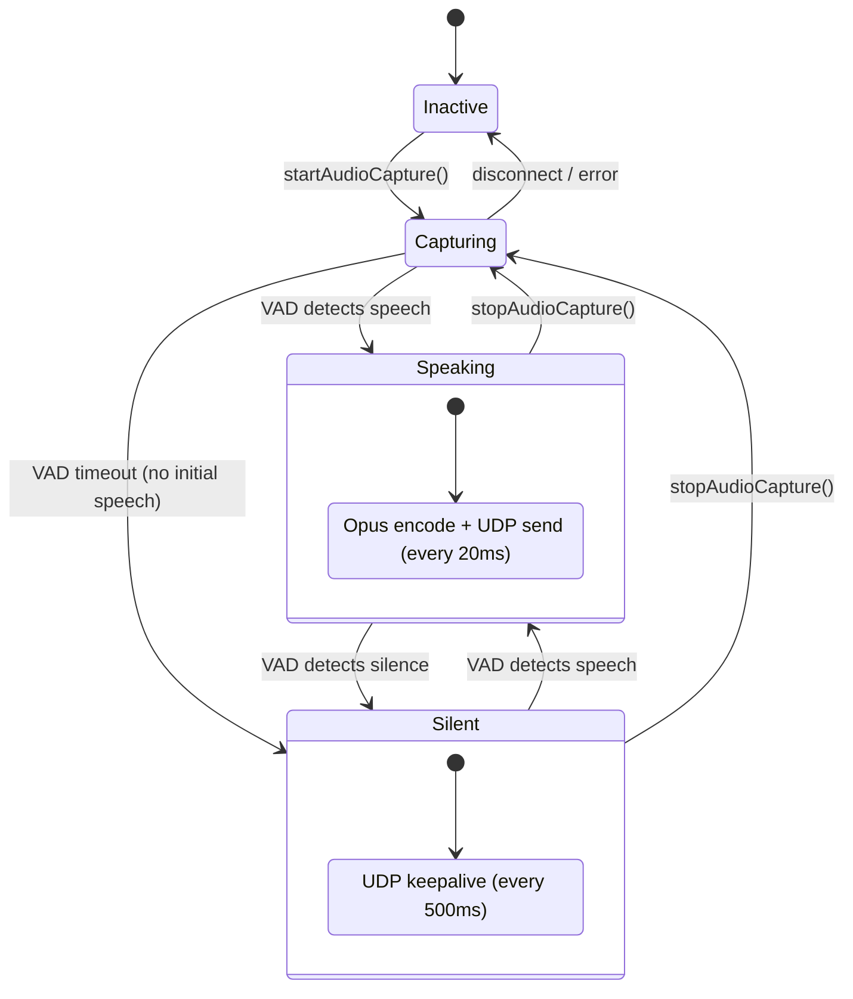
```mermaid
stateDiagram-v2
    [*] --> Inactive

    Inactive --> Capturing : startAudioCapture()
    Capturing --> Speaking : VAD detects speech
    Capturing --> Silent : VAD timeout (no initial speech)
    Speaking --> Silent : VAD detects silence
    Silent --> Speaking : VAD detects speech
    Speaking --> Capturing : stopAudioCapture()
    Silent --> Capturing : stopAudioCapture()
    Capturing --> Inactive : disconnect / error

    state Speaking {
        [*] --> SendingVoice
        SendingVoice : Opus encode + UDP send (every 20ms)
    }

    state Silent {
        [*] --> SendingKeepalive
        SendingKeepalive : UDP keepalive (every 500ms)
    }
```

### 6.3 Media Host State Machine

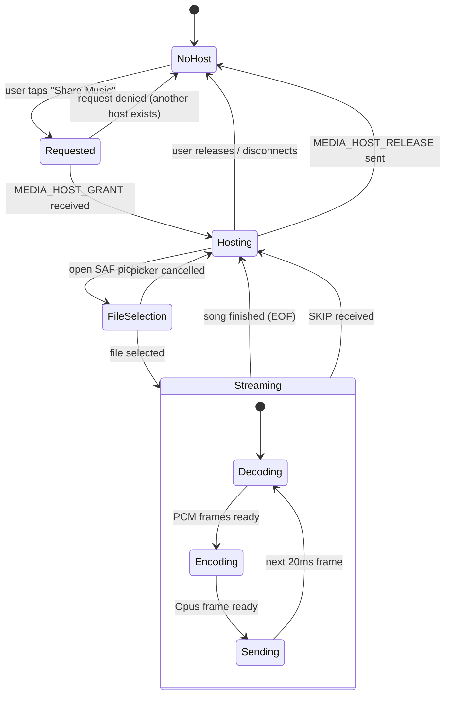
```mermaid
stateDiagram-v2
    [*] --> NoHost

    NoHost --> Requested : user taps "Share Music"
    Requested --> Hosting : MEDIA_HOST_GRANT received
    Requested --> NoHost : request denied (another host exists)
    Hosting --> FileSelection : open SAF picker
    FileSelection --> Streaming : file selected
    FileSelection --> Hosting : picker cancelled
    Streaming --> Hosting : song finished (EOF)
    Streaming --> Hosting : SKIP received
    Hosting --> NoHost : user releases / disconnects
    Hosting --> NoHost : MEDIA_HOST_RELEASE sent

    state Streaming {
        [*] --> Decoding
        Decoding --> Encoding : PCM frames ready
        Encoding --> Sending : Opus frame ready
        Sending --> Decoding : next 20ms frame
    }
```

### 6.4 Ducking State Machine (Per-Client Mixer)

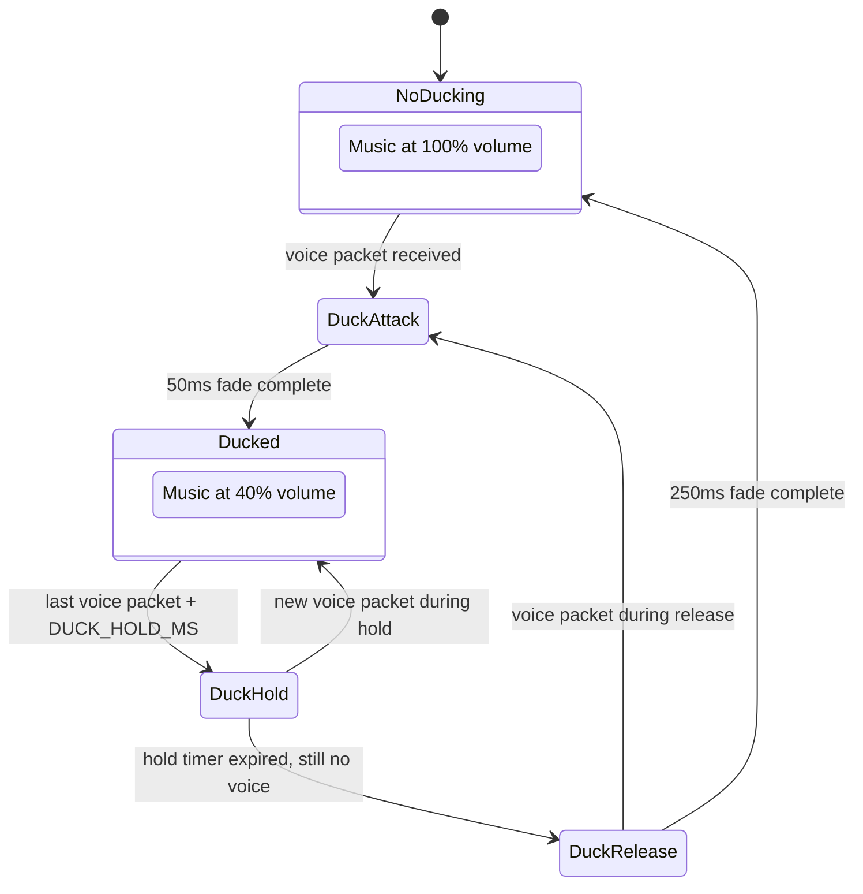
```mermaid
stateDiagram-v2
    [*] --> NoDucking

    NoDucking --> DuckAttack : voice packet received
    DuckAttack --> Ducked : 50ms fade complete
    Ducked --> DuckHold : last voice packet + DUCK_HOLD_MS
    DuckHold --> DuckRelease : hold timer expired, still no voice
    DuckHold --> Ducked : new voice packet during hold
    DuckRelease --> NoDucking : 250ms fade complete
    DuckRelease --> DuckAttack : voice packet during release

    state NoDucking {
        [*] : Music at 100% volume
    }
    state Ducked {
        [*] : Music at 40% volume
    }
```

---

## 7. Interface Contracts

### 7.1 PeerSyncEngine (Orchestrator)

The central coordinator in `androidMain`. The ViewModels communicate with it.

```kotlin
// engine/PeerSyncEngine.kt
class PeerSyncEngine(
    private val context: Context,
    private val wifiP2p: WifiP2pController,
    private val tcpPlane: TcpControlPlane,
    private val udpPlane: UdpDataPlane,
    private val audioBridge: AudioBridge,
    private val pinManager: PinManager
) {
    // --- Observable State ---
    val connectionState: StateFlow<ConnectionState>
    val peers: StateFlow<List<PeerDevice>>
    val discoveredSessions: StateFlow<List<SessionInfo>>
    val mediaHostId: StateFlow<Int?>
    val selfId: StateFlow<Int>                  // This device's User Origin ID
    val audioLevels: StateFlow<Map<Int, Float>> // Per-peer audio levels (0.0–1.0)
    val musicPlaybackState: StateFlow<MusicPlaybackState> // PLAYING, PAUSED, STOPPED

    // --- Session Lifecycle ---
    suspend fun startDiscovery()
    suspend fun stopDiscovery()
    suspend fun createSession(): String          // Returns the generated PIN
    suspend fun joinSession(deviceAddress: String, pin: String): Result<Unit>
    suspend fun disconnect()

    // --- Media Host ---
    suspend fun requestMediaHost()
    suspend fun releaseMediaHost()
    suspend fun selectMusicFile(uri: Uri)        // Called after SAF picker returns
    suspend fun sendMediaControl(action: MediaAction)

    // --- Settings ---
    fun setVadSensitivity(level: Int)            // 0–3 (WebRTC aggressiveness)
}
```

### 7.2 WifiP2pController

```kotlin
// network/WifiP2pController.kt
class WifiP2pController(private val context: Context) {
    val discoveredSessions: StateFlow<List<SessionInfo>>
    val groupInfo: StateFlow<WifiP2pGroup?>

    suspend fun startDiscovery()                          // Register NSD listener
    suspend fun stopDiscovery()                           // Unregister NSD listener
    suspend fun createGroup(): WifiP2pGroup               // Become GO
    suspend fun connect(deviceAddress: String): WifiP2pInfo // Connect to GO
    suspend fun disconnect()                              // Remove group / disconnect
    fun registerNsdService(serviceName: String, sessionToken: String) // GO broadcasts NSD with HMAC token in TXT record
    fun unregisterNsdService()
}
```

### 7.3 TcpControlPlane

```kotlin
// network/TcpControlPlane.kt
class TcpControlPlane {
    val incomingMessages: SharedFlow<Pair<Int, ControlMessage>> // (peerId, message)

    // --- GO Mode ---
    suspend fun startServer(port: Int = TCP_PORT)
    fun stopServer()
    suspend fun sendToClient(clientId: Int, message: ControlMessage)
    suspend fun broadcastToAll(message: ControlMessage)
    suspend fun broadcastToAllExcept(excludeId: Int, message: ControlMessage)

    // --- Client Mode ---
    suspend fun connectToGo(host: String, port: Int = TCP_PORT)
    suspend fun sendToGo(message: ControlMessage)
    fun disconnect()

    // --- Shared ---
    fun getConnectedClientIds(): Set<Int>
}
```

### 7.4 UdpDataPlane

```kotlin
// network/UdpDataPlane.kt
class UdpDataPlane {
    // --- Lifecycle ---
    fun start(port: Int = UDP_PORT)
    fun stop()

    // --- Sending ---
    fun sendPacket(targetIp: String, header: AudioPacketHeader, payload: ByteArray)
    fun broadcastToAll(clientIps: Map<Int, String>, excludeId: Int, header: AudioPacketHeader, payload: ByteArray)

    // --- Receiving ---
    // Callback invoked on the network IO thread; must be fast
    var onPacketReceived: ((senderIp: String, header: AudioPacketHeader, payload: ByteArray) -> Unit)?

    // --- GO Forwarding ---
    // Called by PeerSyncEngine when running as GO
    fun forwardPacket(clientIps: Map<Int, String>, excludeOriginId: Int, rawPacket: ByteArray)
}
```

### 7.5 AudioBridge (JNI)

```kotlin
// audio/AudioBridge.kt
class AudioBridge {
    // --- Lifecycle ---
    external fun initialize(voiceSampleRate: Int, musicSampleRate: Int)
    external fun destroy()

    // --- Capture ---
    external fun startCapture()
    external fun stopCapture()
    external fun setVadAggressiveness(level: Int) // 0–3

    // --- Playback ---
    external fun startPlayback()
    external fun stopPlayback()

    // --- Data Exchange (called from Kotlin network threads) ---
    external fun getEncodedVoiceFrame(): ByteArray?   // Returns null if VAD=silent
    external fun isVadSpeaking(): Boolean
    external fun getAudioLevel(): Float               // 0.0–1.0 RMS of last frame

    // --- Receive Path (called from Kotlin network threads) ---
    external fun feedReceivedPacket(originId: Int, payloadFlag: Int, opusPayload: ByteArray)

    // --- Music (called from MediaHostManager) ---
    external fun feedMusicPcm(pcmSamples: ShortArray, sampleRate: Int, channels: Int)
    external fun getEncodedMusicFrame(): ByteArray?

    companion object {
        init { System.loadLibrary("peersync_audio") }
    }
}
```

### 7.6 PinManager

```kotlin
// security/PinManager.kt
class PinManager {
    private val attemptCounts = ConcurrentHashMap<String, AtomicInteger>() // keyed by IP
    private val cooldownUntil = ConcurrentHashMap<String, Long>()

    fun generatePin(): String                         // SecureRandom, 6-digit, zero-padded
    fun generateSessionToken(pin: String): String     // HMAC-SHA256(pin + nonce) for NSD TXT record (SRS §3.1)
    fun validatePin(submittedPin: String, correctPin: String, clientIp: String): PinResult

    sealed class PinResult {
        data object Valid : PinResult()
        data object Invalid : PinResult()
        data class RateLimited(val cooldownRemainingMs: Long) : PinResult()
    }
}
```

---

## 8. Threading & Concurrency Model

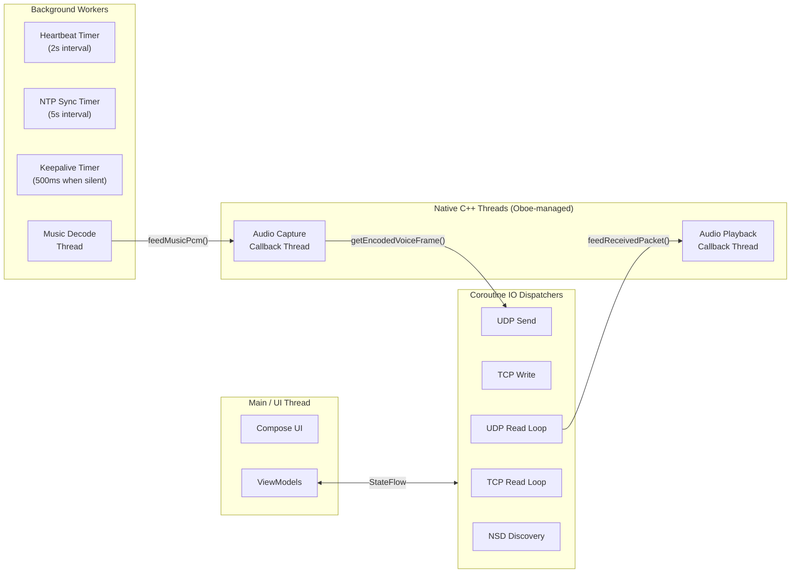
```mermaid
flowchart LR
    subgraph MainThread ["Main / UI Thread"]
        Compose["Compose UI"]
        ViewModel["ViewModels"]
    end

    subgraph IOPool ["Coroutine IO Dispatchers"]
        TCP_R["TCP Read Loop"]
        TCP_W["TCP Write"]
        UDP_R["UDP Read Loop"]
        UDP_W["UDP Send"]
        NSD_D["NSD Discovery"]
    end

    subgraph NativeThreads ["Native C++ Threads (Oboe-managed)"]
        CaptureThread["Audio Capture\nCallback Thread"]
        PlaybackThread["Audio Playback\nCallback Thread"]
    end

    subgraph Worker ["Background Workers"]
        HeartbeatLoop["Heartbeat Timer\n(2s interval)"]
        NtpLoop["NTP Sync Timer\n(5s interval)"]
        KeepaliveLoop["Keepalive Timer\n(500ms when silent)"]
        MusicDecode["Music Decode\nThread"]
    end

    ViewModel <-->|"StateFlow"| IOPool
    UDP_R -->|"feedReceivedPacket()"| PlaybackThread
    CaptureThread -->|"getEncodedVoiceFrame()"| UDP_W
    MusicDecode -->|"feedMusicPcm()"| CaptureThread
```

### Threading Rules

1. **Oboe audio callbacks** run on high-priority real-time threads managed by Oboe. **Never block** in these callbacks — no locks, no allocations, no JNI calls from within the callback itself. Use lock-free ring buffers to pass data in/out.

2. **UDP read loop** runs on a dedicated `Dispatchers.IO` coroutine. On packet arrival, it immediately calls `AudioBridge.feedReceivedPacket()` which writes to the native receive ring buffer. This must complete in < 1ms.

3. **TCP read loop** runs on a dedicated `Dispatchers.IO` coroutine per connected client (GO mode) or a single coroutine (client mode). Incoming messages are parsed and emitted to `SharedFlow`.

4. **Music decode thread** is a dedicated Kotlin coroutine on `Dispatchers.Default`. It reads from the content URI, decodes via `MediaCodec`, and feeds PCM to `AudioBridge.feedMusicPcm()`.

5. **ViewModels** observe `StateFlow` on `Dispatchers.Main`. All UI state is derived from the engine's state flows.

6. **No direct cross-thread mutable state.** All shared state uses `StateFlow`, `SharedFlow`, `ConcurrentHashMap`, or `AtomicInteger`. The native C++ layer uses lock-free ring buffers exclusively.

---

## 9. C++ Native Layer Specification

### 9.1 Ring Buffer

```cpp
// ring_buffer.h
// Single-Producer Single-Consumer lock-free ring buffer
template<typename T>
class RingBuffer {
public:
    explicit RingBuffer(size_t capacity);
    bool write(const T* data, size_t count);   // Returns false if full
    size_t read(T* output, size_t maxCount);   // Returns number of items read
    size_t availableRead() const;
    size_t availableWrite() const;
    void clear();
private:
    std::vector<T> buffer_;
    std::atomic<size_t> readIndex_;
    std::atomic<size_t> writeIndex_;
    size_t capacity_;
};
```

### 9.2 Audio Engine

```cpp
// audio_engine.h
class AudioEngine : public oboe::AudioStreamDataCallback {
public:
    void initialize(int32_t voiceSampleRate, int32_t musicSampleRate);
    void destroy();

    void startCapture();
    void stopCapture();
    void startPlayback();
    void stopPlayback();

    // Oboe callbacks (called on real-time thread)
    oboe::DataCallbackResult onAudioReady(
        oboe::AudioStream* stream, void* audioData, int32_t numFrames) override;

    // Inter-thread data exchange via ring buffers
    RingBuffer<int16_t> captureRingBuffer;    // Capture thread → JNI read
    RingBuffer<int16_t> playbackRingBuffer;   // JNI write → Playback thread

private:
    std::shared_ptr<oboe::AudioStream> captureStream_;
    std::shared_ptr<oboe::AudioStream> playbackStream_;
};
```

### 9.3 Opus Codec

```cpp
// opus_codec.h
class OpusCodec {
public:
    // Voice: sampleRate=16000, channels=1, bitrate=24000
    // Music: sampleRate=44100, channels=2, bitrate=96000
    void initEncoder(int32_t sampleRate, int32_t channels, int32_t bitrate, int32_t application);
    void initDecoder(int32_t sampleRate, int32_t channels);
    void destroyEncoder();
    void destroyDecoder();

    // Returns encoded bytes count; output must be pre-allocated (max 4000 bytes)
    int32_t encode(const int16_t* pcmInput, int32_t frameSamples, uint8_t* output, int32_t maxOutputBytes);

    // Returns decoded samples count
    int32_t decode(const uint8_t* opusInput, int32_t inputBytes, int16_t* pcmOutput, int32_t maxOutputSamples);

private:
    OpusEncoder* encoder_ = nullptr;
    OpusDecoder* decoder_ = nullptr;
};
```

### 9.4 Jitter Buffer

```cpp
// jitter_buffer.h
class JitterBuffer {
public:
    explicit JitterBuffer(size_t depth);  // depth = JITTER_BUFFER_DEPTH (3)

    // Insert a packet. Returns false if duplicate or buffer full.
    bool insert(uint16_t sequenceIndex, const uint8_t* data, size_t dataSize);

    // Pop the next in-order packet. Returns false if not ready (buffer not filled).
    bool pop(uint8_t* output, size_t* outputSize);

    // True when >= depth packets are buffered and ready for sequential pop
    bool isReady() const;

    void reset();

private:
    struct Packet {
        uint16_t seq;
        std::vector<uint8_t> data;
        bool valid;
    };
    std::vector<Packet> buffer_;
    size_t depth_;
    uint16_t nextExpectedSeq_;
    bool primed_;  // True after first depth packets received
};
```

### 9.5 Mixer & Ducking

```cpp
// mixer.h
class Mixer {
public:
    Mixer();

    // Add decoded PCM from a peer's voice stream
    void addVoiceStream(int originId, const int16_t* pcm, int32_t sampleCount);

    // Add decoded PCM from the music stream
    void addMusicStream(const int16_t* pcm, int32_t sampleCount);

    // Mix all active streams into output buffer, applying ducking
    // Returns number of samples written
    int32_t mixTo(int16_t* output, int32_t maxSamples);

    // Ducking state
    void setDuckParams(float attackMs, float releaseMs, float holdMs, float attenuation);

private:
    // Per-stream accumulation buffers
    std::unordered_map<int, std::vector<int16_t>> voiceBuffers_;
    std::vector<int16_t> musicBuffer_;

    // Ducking state machine
    enum class DuckState { NONE, ATTACK, DUCKED, HOLD, RELEASE };
    DuckState duckState_;
    float duckGain_;          // Current music gain multiplier (0.4 – 1.0)
    int64_t lastVoiceTimeNs_; // Timestamp of last voice sample
    float attackRatePerSample_;
    float releaseRatePerSample_;
    float holdDurationNs_;
    float targetAttenuation_;
};
```

### 9.6 WebRTC VAD Wrapper

```cpp
// webrtc_vad.h
class VadWrapper {
public:
    VadWrapper();
    ~VadWrapper();

    // aggressiveness: 0 (least aggressive) to 3 (most aggressive)
    void initialize(int32_t sampleRate, int32_t aggressiveness = 2);

    // Process a 10ms or 20ms frame. Returns true if speech detected.
    // For 16kHz + 20ms: frameSamples = 320
    bool process(const int16_t* pcm, size_t frameSamples);

    void setAggressiveness(int32_t level);

private:
    VadInst* vadHandle_;
};
```

### 9.7 CMakeLists.txt Structure

```cmake
cmake_minimum_required(VERSION 3.22)
project(peersync_audio)

# Oboe
set(OBOE_DIR ${CMAKE_CURRENT_SOURCE_DIR}/third_party/oboe)
add_subdirectory(${OBOE_DIR} oboe)

# Opus (pre-built or build from source)
add_library(opus STATIC IMPORTED)
set_target_properties(opus PROPERTIES IMPORTED_LOCATION
    ${CMAKE_CURRENT_SOURCE_DIR}/third_party/opus/lib/${ANDROID_ABI}/libopus.a)
target_include_directories(opus INTERFACE
    ${CMAKE_CURRENT_SOURCE_DIR}/third_party/opus/include)

# WebRTC VAD (extracted from WebRTC)
add_library(webrtc_vad STATIC
    third_party/webrtc_vad/vad_core.c
    third_party/webrtc_vad/vad_filterbank.c
    third_party/webrtc_vad/vad_gmm.c
    third_party/webrtc_vad/vad_sp.c
    third_party/webrtc_vad/webrtc_vad.c)

# PeerSync native library
add_library(peersync_audio SHARED
    jni_bridge.cpp
    audio_engine.cpp
    opus_codec.cpp
    ring_buffer.cpp
    jitter_buffer.cpp
    mixer.cpp
    webrtc_vad.cpp)

target_link_libraries(peersync_audio
    oboe
    opus
    webrtc_vad
    android
    log)
```

---

## 10. Error Handling & Edge Cases

### 10.1 Network Errors

| Scenario | Detection | Recovery |
| :--- | :--- | :--- |
| TCP connection lost (client) | `SocketException` in read loop | Attempt reconnect 3× with 2s backoff. If all fail, trigger GO failover detection. |
| TCP connection lost (GO side) | `SocketException` in per-client read loop | Remove client from member list, broadcast `MEMBER_LEFT`. |
| UDP send fails | `IOException` from `DatagramSocket.send()` | Log and skip. UDP is fire-and-forget. |
| Wi-Fi Direct group destroyed | `WifiP2pManager.WIFI_P2P_CONNECTION_CHANGED_ACTION` broadcast | Trigger full disconnect → Session List. |
| NSD discovery fails | `WifiP2pManager.WIFI_P2P_DISCOVERY_CHANGED_ACTION` with state=STOPPED | Retry `discoverServices()` after 3s. Max 5 retries. |

### 10.2 Audio Errors

| Scenario | Detection | Recovery |
| :--- | :--- | :--- |
| Oboe stream disconnected | `onErrorAfterClose()` callback | Re-create the stream with same parameters. Oboe handles device routing changes. |
| Opus encode returns error | Negative return from `opus_encode()` | Log error code. Skip this frame (20ms gap). |
| Opus decode returns error | Negative return from `opus_decode()` | Use Opus PLC (Packet Loss Concealment): call `opus_decode(NULL, 0, ...)` to generate a comfort frame. |
| Ring buffer overflow | `write()` returns false | Drop the oldest data (overwrite). Log as warning. |
| Jitter buffer: packet too late | Sequence index < `nextExpectedSeq_ - depth` | Drop packet silently. |
| Jitter buffer: duplicate seq | Same sequence index already in buffer | Drop packet silently. |

### 10.3 Permission Errors

| Scenario | Recovery |
| :--- | :--- |
| `RECORD_AUDIO` denied | Show error: "Microphone access required for intercom." Offer Settings link. Disable join/create. |
| `NEARBY_WIFI_DEVICES` denied | Show error: "Wi-Fi access required to find nearby devices." Offer Settings link. Disable discovery. |
| `POST_NOTIFICATIONS` denied | Foreground service may not show notification on API 33+. Still functional, but warn user. (No action needed on API 30-32). |

### 10.4 Edge Cases

| Scenario | Behavior |
| :--- | :--- |
| 6th device tries to join (MAX_PEERS exceeded) | GO sends `JOIN_RESPONSE { accepted: false, reason: "Session full" }`. |
| Two devices request Media Host simultaneously | GO processes requests serially (TCP is ordered). First request wins; second gets denied. |
| Media Host disconnects while streaming | GO broadcasts `MEMBER_LEFT` + `MEDIA_HOST_GRANT { hostId: null }`. Music stops on all clients. |
| Sequence index wraps (65535 → 0) | Jitter buffer uses modular arithmetic for comparisons: `(a - b) > 32768` means `a < b`. |
| Phone call interrupts audio | `AudioManager.OnAudioFocusChangeListener` detects transient loss. Pause capture, resume when focus returns. |
| Bluetooth headset connects mid-session | Oboe handles device routing changes automatically via `onErrorAfterClose()` + stream restart. |

---

## 11. GO Routing Logic (Detailed)

The GO is both a **participant** (it captures and plays audio) and a **router** (it forwards packets between clients). This dual role must be carefully separated.

### 11.1 GO Packet Handling Pseudocode

```
ON UDP_PACKET_RECEIVED(senderIp, rawPacket):
    header = parseHeader(rawPacket)  // 4 bytes

    IF header.originId == MY_ID:
        RETURN  // Should never happen; ignore

    // 1. Forward to all OTHER clients (not back to sender)
    FOR EACH (clientId, clientIp) IN connectedClients:
        IF clientId != header.originId:
            udpPlane.sendRaw(clientIp, rawPacket)

    // 2. Feed to GO's own playback pipeline
    IF header.payloadFlag == FLAG_VOICE OR header.payloadFlag == FLAG_MUSIC:
        audioBridge.feedReceivedPacket(header.originId, header.payloadFlag, payload)

    // 3. Keep-alive: just note that the client is still alive
    IF header.payloadFlag == FLAG_KEEPALIVE:
        updateLastSeenTimestamp(header.originId)
```

### 11.2 GO's Own Voice Transmission

```
ON VOICE_FRAME_READY(opusPayload):
    header = AudioPacketHeader(originId=0, flag=FLAG_VOICE, seq=voiceSeq++)

    // Send to all clients (GO doesn't need to forward to itself)
    FOR EACH (clientId, clientIp) IN connectedClients:
        udpPlane.sendPacket(clientIp, header, opusPayload)
```

---

## 12. Bandwidth Budget Analysis

With 5 peers all speaking + 1 music stream, worst-case bandwidth at the GO:

### 12.1 Inbound to GO

| Stream | Count | Bitrate | Total |
| :--- | :--- | :--- | :--- |
| Voice from clients | 4 | 24 kbps | 96 kbps |
| Music (if GO is not host) | 1 | 96 kbps | 96 kbps |
| **Total Inbound** | | | **192 kbps** |

### 12.2 Outbound from GO (per client)

| Stream | Count | Bitrate | Total |
| :--- | :--- | :--- | :--- |
| Voice (3 other clients + GO's own) | 4 | 24 kbps | 96 kbps |
| Music (1 stream) | 1 | 96 kbps | 96 kbps |
| **Per-Client Outbound** | | | **192 kbps** |

### 12.3 Total GO Outbound

| Clients | Per-Client | Total |
| :--- | :--- | :--- |
| 4 | 192 kbps | **768 kbps** |

**Total GO throughput: ~1 Mbps** (inbound + outbound). Wi-Fi Direct supports 250+ Mbps. This is well within limits.

---

## 13. Build & Dependency Versions

### 13.1 Version Catalog (`gradle/libs.versions.toml`)

```toml
[versions]
kotlin = "2.1.10"
compose-multiplatform = "1.8.0"
agp = "8.7.3"
compose-navigation = "2.9.0"
kotlinx-coroutines = "1.10.1"
kotlinx-serialization = "1.8.0"

[libraries]
kotlinx-coroutines-core = { module = "org.jetbrains.kotlinx:kotlinx-coroutines-core", version.ref = "kotlinx-coroutines" }
kotlinx-coroutines-android = { module = "org.jetbrains.kotlinx:kotlinx-coroutines-android", version.ref = "kotlinx-coroutines" }
kotlinx-serialization-json = { module = "org.jetbrains.kotlinx:kotlinx-serialization-json", version.ref = "kotlinx-serialization" }
compose-navigation = { module = "org.jetbrains.androidx.navigation:navigation-compose", version.ref = "compose-navigation" }

[plugins]
kotlin-multiplatform = { id = "org.jetbrains.kotlin.multiplatform", version.ref = "kotlin" }
kotlin-serialization = { id = "org.jetbrains.kotlin.plugin.serialization", version.ref = "kotlin" }
compose-multiplatform = { id = "org.jetbrains.compose", version.ref = "compose-multiplatform" }
compose-compiler = { id = "org.jetbrains.kotlin.plugin.compose", version.ref = "kotlin" }
android-application = { id = "com.android.application", version.ref = "agp" }
```

### 13.2 Native Dependencies

| Library | Version | Purpose | Integration |
| :--- | :--- | :--- | :--- |
| **Oboe** | 1.9.x | Audio I/O (wraps AAudio) | Git submodule → `add_subdirectory()` |
| **libopus** | 1.5.x | Opus encode/decode | Pre-built `.a` per ABI or build from source |
| **WebRTC VAD** | Extracted from WebRTC M120+ | Voice activity detection | Vendored C source files (~5 files) |

---

## 14. UI Screen Specifications

### 14.1 Session List Screen

```
┌─────────────────────────────────────┐
│  PeerSync                    [⚙️]   │  ← Top bar with settings icon
├─────────────────────────────────────┤
│                                     │
│  📡 Searching for nearby sessions...│  ← Loading state
│                                     │
│  ┌─────────────────────────────┐    │
│  │ 📶 "Galaxy S24"            │    │  ← Discovered session card
│  │    Tap to join              │    │
│  └─────────────────────────────┘    │
│                                     │
│  ┌─────────────────────────────┐    │
│  │ 📶 "Pixel 8 Pro"           │    │
│  │    Tap to join              │    │
│  └─────────────────────────────┘    │
│                                     │
│                                     │
│  ┌─────────────────────────────┐    │
│  │       ➕ Create Session      │    │  ← Primary button
│  └─────────────────────────────┘    │
│                                     │
└─────────────────────────────────────┘
```

**PIN Entry Dialog** (shown when user taps a session):
```
┌─────────────────────────────────┐
│       Enter Session PIN         │
│                                 │
│    ┌──┬──┬──┬──┬──┬──┐         │
│    │ 4│ 8│ 2│ 9│ 0│ 1│         │  ← 6-digit input
│    └──┴──┴──┴──┴──┴──┘         │
│                                 │
│    [Cancel]          [Join]     │
└─────────────────────────────────┘
```

### 14.2 Active Session Screen

```
┌─────────────────────────────────────┐
│  ← Back    Active Session    PIN:4829│  ← PIN visible for sharing
├─────────────────────────────────────┤
│                                     │
│  Connected Peers (3/5)              │
│                                     │
│  ┌─────────────────────────────┐    │
│  │ 👤 You (GO)        🟢 ████ │    │  ← Audio level bar
│  └─────────────────────────────┘    │
│  ┌─────────────────────────────┐    │
│  │ 👤 Pixel 8         🟢 ██   │    │
│  └─────────────────────────────┘    │
│  ┌─────────────────────────────┐    │
│  │ 🎵 Galaxy S24 (Music) 🟢 █ │    │  ← Media host indicator
│  └─────────────────────────────┘    │
│                                     │
│  ┌─────────────────────────────┐    │
│  │  ⏮  │  ▶ / ⏸  │  ⏭      │    │  ← Media controls (all peers)
│  │     Now: song_name.mp3     │    │
│  └─────────────────────────────┘    │
│                                     │
│  ┌──────────┐  ┌───────────────┐    │
│  │🎵 Share  │  │ 🔴 Disconnect │    │
│  │  Music   │  │               │    │
│  └──────────┘  └───────────────┘    │
│                                     │
│  VAD Sensitivity: ████░░ [2/3]      │  ← Slider
│                                     │
└─────────────────────────────────────┘
```

---

## 15. Checklist — Pre-Coding Verification

Before writing any code, verify that this document answers every question:

- [x] What exact files/classes to create? → §2
- [x] What data flows between them? → §5 (Sequence Diagrams)
- [x] What does every TCP message look like? → §3.2, §3.3
- [x] What does every UDP packet look like? → §3.1
- [x] What are the exact Kotlin interface signatures? → §7
- [x] What are the exact C++ class signatures? → §9
- [x] What threads run what code? → §8
- [x] What happens on every user interaction? → §4 (User Flows)
- [x] What happens on every error? → §10
- [x] What are all the magic numbers? → §1
- [x] What state machines govern behavior? → §6
- [x] How does the GO route packets? → §11
- [x] Will bandwidth be sufficient? → §12
- [x] What library versions to use? → §13
- [x] What do the screens look like? → §14
