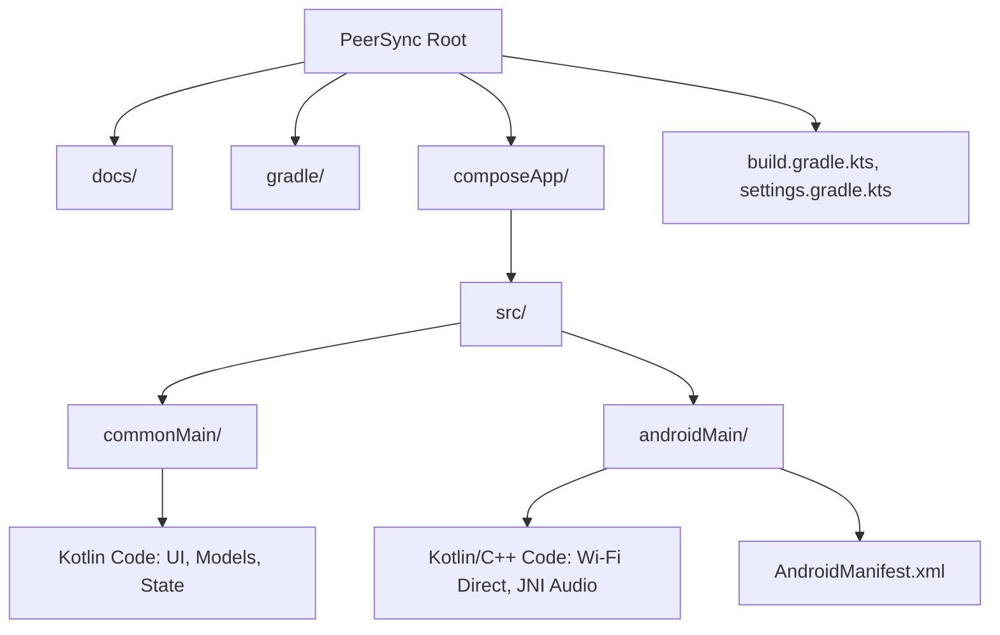
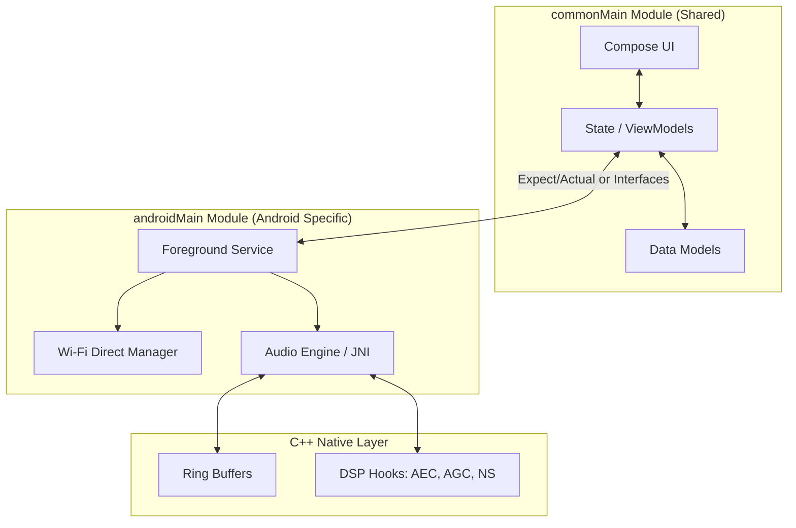

# PeerSync Implementation Plan

This document details the step-by-step implementation plan for the **PeerSync Intercom & Media Share** application. The project will be built using **Kotlin 2.1.x** and **Compose Multiplatform (CMP) 1.8.x** with **Android Gradle Plugin 8.7.x**, currently targeting only Android (minimum **API 30 / Android 11**), but structured to easily support iOS or Desktop in the future.

## 1. Project Architecture & Structure

The project will be scaffolded manually to give us complete control over the setup. The package name will be `com.peersync.app`.

### 1.1 Directory Structure

The project will follow a standard Kotlin Multiplatform (KMP) directory structure.

### 1.2 System Architecture Diagram

This diagram outlines how the cross-platform Compose UI interacts with the Android-specific implementations for Networking and Audio processing.

### 1.3 Resolved Design Decisions

The following design choices have been finalized and must be adhered to throughout implementation:

| Decision Area | Choice | Rationale |
| :--- | :--- | :--- |
| **Min SDK** | API 30 (Android 11) | Allows compatibility with older devices. Modern permission model (`POST_NOTIFICATIONS`) applies to API 33+. `FOREGROUND_SERVICE_CONNECTED_DEVICE` handled via compat for API 34+. |
| **Version Stack** | Kotlin 2.1.x, CMP 1.8.x, AGP 8.7.x | Latest stable. K2 compiler, full Material 3, type-safe navigation. |
| **Audio Codec** | Opus (VOIP mode for voice, Audio mode for music) | Sub-5ms algorithmic delay, 24 kbps voice / 96–128 kbps music. Single codec for both streams. |
| **Opus Frame Size** | 20ms | VoIP standard. 50 packets/sec per stream, ~80 bytes/packet at 32 kbps. |
| **Native Audio API** | AAudio (via JNI) | Direct use of AAudio hardware abstraction layer through C++ JNI bindings for minimum latency and OEM compatibility on API 30+. |
| **VAD Algorithm** | WebRTC VAD (GMM-based) | More accurate speech/noise discrimination than energy-only. ~2ms overhead fits latency budget. Integrated via `libwebrtc_vad` in C++ layer. |
| **Jitter Buffer** | Fixed-depth (2–3 packets = 40–60ms) | Deterministic latency on local Wi-Fi Direct network (low, predictable jitter). Drop late packets per SRS §5.2. |
| **GO Selection** | Manual — session creator is GO | Predictable UX. Failover uses automatic re-election. |
| **GO Failover Election** | Highest User Origin ID wins | Deterministic, zero inter-client negotiation needed. Each client independently derives the same result. |
| **GO Audio Routing** | Forward individual streams (no server-side mixing) | Preserves per-speaker identity for future per-user volume control. Clients mix N-1 voice streams locally. |
| **Session Security** | 8-digit numeric PIN | Communicated verbally. Rate-limited (3 attempts then 30s cooldown). Sufficient for local network threat model. Required for WPA2 passphrase. |
| **Audio Ducking Curve** | Fast fade: ~50ms duck-in, ~200–300ms restore | Broadcast-style. Avoids click artifacts on duck, avoids jarring pop on restore. |
| **Music File Selection** | Android SAF (`ACTION_OPEN_DOCUMENT`) | Zero extra storage permissions required. Native OS picker. |
| **Media Controls** | Group Owner only | Only the session creator (GO) broadcasts music. All peers can view playback state and trigger Play/Pause/Skip commands to the GO. |
| **UI Navigation** | 2 screens: Session List → Active Session | Minimal, utility-focused. Open app → tap join → talk. |

## 2. Implementation Phases

### Phase 1: Project Scaffolding (Manual Setup)

Since we are scaffolding manually, the first phase involves setting up the Gradle build system and the KMP structure.

1. **Root Configuration:**

- Create `settings.gradle.kts` to define the project name (`PeerSync`) and include the `composeApp` module.
- Create root `build.gradle.kts` to define plugin versions: Kotlin `2.1.x`, Compose Multiplatform `1.8.x`, Android Gradle Plugin `8.7.x`.
- Create `gradle.properties` for KMP and Android specific flags (e.g., `android.useAndroidX=true`).

2. **Module Configuration (**`composeApp`**):**

- Create `composeApp/build.gradle.kts`.
- Apply plugins: `org.jetbrains.kotlin.multiplatform`, `org.jetbrains.compose`, `com.android.application`.
- Define targets: `androidTarget()`.
- Define source sets: `commonMain` and `androidMain`.

3. **Android Application Basics:**

- Create `composeApp/src/androidMain/AndroidManifest.xml`.
  - Set `minSdk = 33`, `targetSdk = 35`.
  - Add dangerous (runtime) permissions: `NEARBY_WIFI_DEVICES`, `ACCESS_FINE_LOCATION`, `RECORD_AUDIO`, `POST_NOTIFICATIONS` (required on API 33+ for foreground service notifications).
    - *Note on `ACCESS_FINE_LOCATION`:* On API 33+, `NEARBY_WIFI_DEVICES` with `usesPermissionFlags="neverForLocation"` may eliminate this requirement. Retain as a compatibility safeguard per SRS §4.3; remove after device testing confirms it is not needed.
  - Add normal permissions: `FOREGROUND_SERVICE`, `FOREGROUND_SERVICE_CONNECTED_DEVICE` (Android 14+), `ACCESS_WIFI_STATE`, `CHANGE_WIFI_STATE`, `WAKE_LOCK`.
  - Declare the `MainActivity` and `PeerSyncService` (Foreground Service with `foregroundServiceType="connectedDevice"`).
- Create `composeApp/src/androidMain/kotlin/com/peersync/app/MainActivity.kt` extending `ComponentActivity` and calling `setContent`.

4. **Runtime Permission Handling:**

- Implement a runtime permission request flow in `MainActivity` using `ActivityResultContracts.RequestMultiplePermissions()`.
- Display rationale dialogs explaining why each dangerous permission (`NEARBY_WIFI_DEVICES`, `ACCESS_FINE_LOCATION`, `RECORD_AUDIO`, `POST_NOTIFICATIONS`) is required before requesting.
- Gate all networking and audio functionality behind successful permission grants — the app must not attempt Wi-Fi Direct or mic access without approval.

5. **Shared UI Foundation:**

- Create `composeApp/src/commonMain/kotlin/com/peersync/app/App.kt`.
- Create the Compose `App()` function with Material 3 theme.
- Implement a **2-screen navigation** structure:
  - **Session List Screen:** Displays discovered nearby sessions (via Wi-Fi Direct scanning), a "Create Session" button, and PIN entry for joining.
  - **Active Session Screen:** Shows connected peers with live audio level indicators, music playback controls (Group Owner only for selection, all peers can Play/Pause/Skip), and a disconnect button.

### Phase 2: Core Networking (Wi-Fi Direct P2P)

Implementing the Hub-and-Spoke local star topology using Wi-Fi Direct P2P and raw TCP/UDP sockets.

1. **Service Integration:** Create the Android Foreground Service (`PeerSyncService`) to host the network and audio loops, ensuring the connection doesn't drop when the screen turns off. Acquire a partial `WAKE_LOCK` to prevent CPU sleep.
2. **Peer Discovery (F-01):** Implement peer discovery using Wi-Fi Direct scanning. The session creator (GO) advertises a unique SSID (`DIRECT-PS-<sessionName>`). Discovering clients see the session and must present the correct PIN during the WPA2 connection handshake to join. The GO generates the **8-digit numeric PIN** and displays it on-screen.
3. **Security — PIN Validation:** When a new device discovers a session and attempts to join via Wi-Fi Direct, it must present the 8-digit PIN during the initial connection request. The GO validates the PIN before accepting the connection. Unauthorized devices are rejected. A **rate limiter** (3 failed attempts → 30-second cooldown) must be enforced to prevent brute-force attacks.
4. **Connection Management:** The user who creates the session is always the initial GO (manual selection). The GO assigns each joining client a unique **User Origin ID** (1 byte, starting from 1; GO is always ID 0).
   - **Client Disconnect Resilience:** When a Client Spoke disconnects, the GO must remove it from the active member list and notify remaining peers. The group conversation must continue uninterrupted.
5. **Group Owner Failover & Re-election Protocol:**
   - The GO must send periodic heartbeat pings to all clients (interval: 1–2 seconds).
   - Each client monitors the GO heartbeat. If no heartbeat is received within a configurable timeout (e.g., 5 seconds), the client declares GO loss.
   - **Highest User Origin ID wins:** Each client independently determines who the new GO should be by selecting the remaining client with the highest assigned User Origin ID. No inter-client negotiation is needed since all clients have the same member list.
   - The elected device advertises a new session (becomes the new GO with ID 0), and all other clients scan for the new group and reconnect.
   - State migration: the new GO rebuilds the active member list and inherits media control. The session PIN remains the same.
   - **Reconnection timeout:** If a client cannot discover and reconnect to the new GO within **30 seconds**, it transitions to `Disconnected` and returns to the Session List screen. Expected recovery window for a successful failover is **~8–12 seconds** (5s heartbeat detection + 3–7s re-election and reconnect).
6. **Dual-Plane Setup via Wi-Fi Direct:**

- The Control Plane (TCP) handles session state, heartbeats, media controls (Play/Pause/Skip), and timing information via serialized control messages.
- The Data Plane (UDP) handles audio streaming with individual packets tagged with source origin and payload type. The GO operates as a **packet forwarder** — it receives each client's audio packets and relays them individually to all other clients without mixing. This preserves per-speaker identity.

### Phase 3: Audio Engine & Native Layer

Building the low-latency audio processing system.

1. **JNI / CMake Setup:** Add C++ support via CMake to the `androidMain` build configuration. Configure the native build for `arm64-v8a` and `armeabi-v7a` ABIs. Add native dependencies: **AAudio** (audio I/O via `<aaudio/AAudio.h>`), **libopus** (codec), **libwebrtc_vad** (voice activity detection).
2. **Communication-Priority Audio Pipeline:** Configure the Android audio session with `AudioManager.MODE_IN_COMMUNICATION` and `AudioAttributes.USAGE_VOICE_COMMUNICATION`. This forces the device's Digital Signal Processor (DSP) into its telephony-grade processing path, which is a prerequisite for hardware-accelerated echo cancellation and noise suppression.
3. **Audio Capture & Playback:** Implement the recording and playback loops using **AAudio** (via direct JNI bindings to `<aaudio/AAudio.h>`) for minimum latency. Voice capture at 16kHz Mono; music playback at 44.1kHz Stereo.
4. **DSP Integration (F-02):** Integrate all three acoustic management components at the hardware abstraction layer:
   - **Acoustic Echo Cancellation (AEC):** Eliminate speaker-to-mic feedback loops.
   - **Automatic Gain Control (AGC):** Normalize input volume across varying distances.
   - **Noise Suppression (NS):** Filter background environmental noise from the mic input.
5. **Opus Codec Integration:** Integrate **libopus** in the C++ layer with two configurations:
   - **Voice mode:** Opus VOIP application type, 16kHz Mono, 20ms frames (50 packets/sec), 24 kbps bitrate.
   - **Music mode:** Opus Audio application type, 44.1kHz Stereo, 20ms frames, 96–128 kbps bitrate.
6. **Native Ring Buffer Memory Management:** Implement lock-free ring buffers in C++ for all audio data paths (capture → encode → network and network → decode → playback). This offloads raw byte array operations to the native layer, avoiding JVM Garbage Collection pauses that would cause audio glitches.
7. **Audio Focus Management:** Request audio focus via `AudioFocusRequest` with `AUDIOFOCUS_GAIN` and `USAGE_VOICE_COMMUNICATION`. Register an `OnAudioFocusChangeListener` to handle interruptions (e.g., incoming phone calls): on transient focus loss, pause audio capture and mute outgoing packets; on focus regain, resume capture seamlessly. This prevents the OS from stopping audio streams while the foreground service is running.
8. **Voice Activation Detection (VAD):** Integrate **WebRTC VAD** (`libwebrtc_vad`, GMM-based) for accurate speech/noise discrimination. Processing overhead is ~2ms per frame, within the latency budget.
   - When the VAD classifies input as non-speech, halt payload packet transmission.
   - Replace payload packets with lightweight **Keep-Alive heartbeat packets** (payload flag `0x00`, minimal size) sent at a reduced interval (every 500ms) to maintain socket liveness and signal continued presence to the GO.
   - The VAD sensitivity should be user-configurable (maps to WebRTC VAD aggressiveness levels 0–3).

### Phase 4: Mixing & Media Sharing (F-03)

1. **Packet Structure:** Implement the 4-byte header structure for all UDP packets:
   - Byte 0: *User Origin ID* (1 byte — identifies the speaking/sharing device, supports up to 255 peers).
   - Byte 1: *Payload Flag* (`0x00` = Keep-Alive heartbeat, `0x01` = Voice at 16kHz Mono, `0x02` = Music at 44.1kHz Stereo).
   - Bytes 2–3: *Sequence Index* (2 bytes, unsigned — tracks chronological packet ordering for the jitter buffer).
2. **Media Host Logic:** Only the Group Owner (session creator) can broadcast music to all participants. The GO selects a music file using the **Android SAF file picker** (`ACTION_OPEN_DOCUMENT`), decodes it to PCM locally, re-encodes with **Opus Audio mode** (44.1kHz Stereo, 96–128 kbps), and streams it as separate audio packets (flag `0x02`) alongside its voice stream (flag `0x01`). This preserves audio fidelity by keeping the two pipelines structurally separate. All peers can view the current playback state and send Play/Pause/Skip commands to the GO.
3. **Client-Side Mixing & Ducking:** Each receiving client runs a local digital mixer that sums up to **N-1 individual voice streams** (forwarded by the GO) plus 1 music stream. When any `0x01` (Voice) packet is detected, apply a **fast-fade audio duck**: attenuate the `0x02` (Music) stream volume by **60%** over ~50ms (as per SRS TC-02). Restore music volume over ~200–300ms once voice packets cease for a configurable silence window.
4. **Media Playback Controls:** Any connected peer can send Play/Pause/Skip commands to the GO. The GO broadcasts the command to all peers, which update their local playback state and rendering. This keeps the star topology intact and provides shared playback control.
5. **Jitter Buffer:** Implement a **fixed-depth jitter buffer** (2–3 packets = 40–60ms at 20ms Opus frame size) modeled on RTP sequence architectures (per SRS §5.2). The buffer reorders incoming packets by their Sequence Index and drops late packets rather than delaying the real-time audio playback stream. Fixed depth is appropriate for the low, predictable jitter of a local Wi-Fi Direct network.
6. **NTP-Style Clock Synchronization:** Implement a clock synchronization mechanism over the TCP control plane to align music playback across all devices. The GO periodically broadcasts timestamp reference packets; clients calculate and apply local clock offset corrections. Target: music playback drift must not exceed **50ms** across devices (per SRS §4.1).
7. **Latency Budget:** Per SRS §4.1, the network round-trip delay across all 5 active nodes over the data plane must not exceed **40ms**.
   - **Network RTT budget** (SRS §4.1 target: ≤ 40ms):
     - One-way network transit (sender → GO → receiver): ≤ 10ms
     - Round trip (sender → GO → receiver → GO → sender): ≤ 20ms — **well within the 40ms SRS requirement**
   - **Glass-to-glass one-way audio latency** (informational — not an SRS target):
     - Audio capture & encode (incl. 20ms Opus frame): ≤ 25ms
     - Network transit (one-way): ≤ 10ms
     - Jitter buffer & decode: ≤ 10ms
     - Audio playback render: ≤ 5ms
     - **Total: ~50–60ms one-way** — well within conversational comfort limits (≤ 150ms)

### Phase 5: Verification & Testing

Validating the system against the SRS verification scenarios (§5.1).

1. **TC-01 — Multi-Peer Capacity:** Connect 5 Android devices via Wi-Fi Direct. Verify the Group Owner maps 4 distinct client connections. Confirm all 5 microphones stream concurrently without dropped connections or audio artifacts.
2. **TC-02 — Audio Ducking:** Group Owner plays a local MP3 file while User B begins speaking. Verify that receiving devices decode the Voice header packet and immediately attenuate the Music output level by 60%.
3. **TC-03 — System Persistence:** Lock the device screen on 3 out of 5 connected client phones. Verify the foreground service retains wake-locks, Wi-Fi Direct sockets remain fully active, and the voice feed continues without interruption.
4. **Latency Validation:** Measure round-trip audio delay across all nodes using loopback testing. Verify RTT stays under 40ms under normal operating conditions.
5. **Music Sync Drift:** Measure music playback offset between the Group Owner and all receiving clients. Verify drift stays under 50ms using the clock sync mechanism.
6. **GO Failover Test:** Forcibly kill the GO application mid-session. Verify remaining clients detect the loss, elect a new GO, re-establish all connections, and resume the voice feed within **12 seconds**. Verify clients that cannot reconnect within **30 seconds** gracefully return to the Session List.
